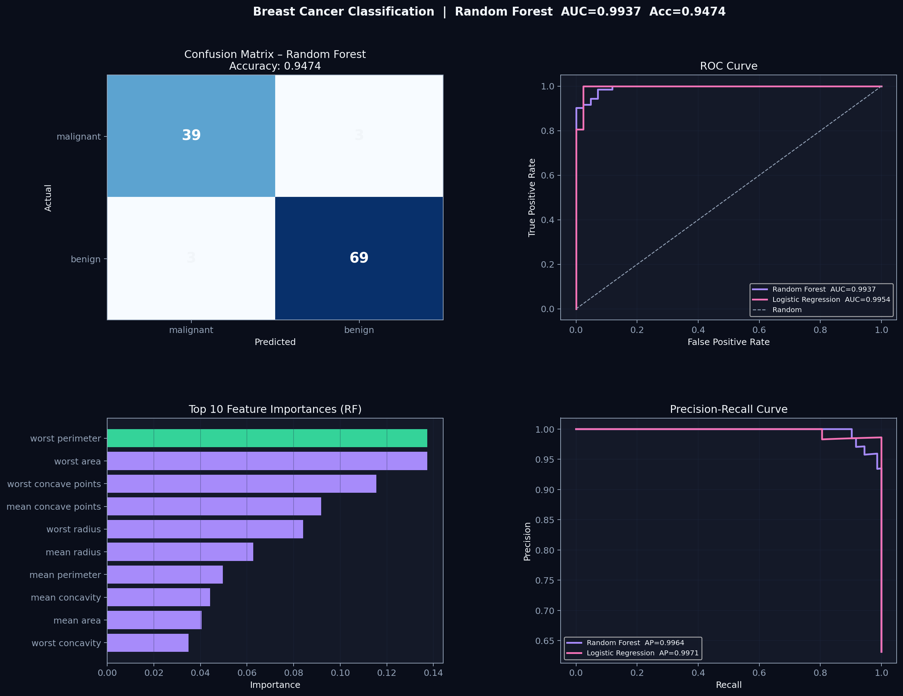

Breast Cancer Classification – End-to-End ML Pipeline
An end-to-end machine learning project for breast cancer classification using the Breast Cancer Wisconsin dataset.
This project compares Logistic Regression (baseline) and Random Forest (ensemble), with a strong focus on model evaluation, interpretability, and real-world reliability.

🚀 Overview
This project goes beyond just training a model.
It answers three critical questions:
Can the model accurately detect cancer?
Can we trust its predictions?
Can we explain why it made them?

📊 Dataset & Features
This project uses the Breast Cancer Wisconsin Dataset available via sklearn.datasets.
Dataset Summary:
Total samples: 569
Features: 30 numerical features
Target classes:
Malignant (0) → Cancerous
Benign (1) → Non-cancerous

🔬 Feature Categories
The dataset is built from digitized images of fine needle aspirate (FNA) of breast masses.
Each feature describes characteristics of the cell nuclei.

1️⃣ Mean (average values)
mean radius
mean texture
mean perimeter
mean area
mean smoothness
mean compactness
mean concavity
mean concave points
mean symmetry
mean fractal dimension

2️⃣ Standard Error (variation)
radius error
texture error
perimeter error
area error
smoothness error
compactness error
concavity error
concave points error
symmetry error
fractal dimension error

3️⃣ Worst (largest values)
worst radius
worst texture
worst perimeter
worst area
worst smoothness
worst compactness
worst concavity
worst concave points
worst symmetry
worst fractal dimension

🎯 Target Variable
0 → Malignant (cancerous)
1 → Benign (non-cancerous)
The goal of the model is to correctly classify tumors into these two categories.
⚙️ Features Used in Modeling

All 30 numerical features were used as input variables
No feature selection was applied initially
Scaling was applied only for Logistic Regression
Random Forest handled raw feature distributions directly

🔍 Key Insight from Feature Importance
The model identified the most influential features as:
Worst perimeter
Worst area
Worst concave points
Mean concave points
Worst radius
These features are strongly associated with tumor size and shape irregularity, which are critical indicators in cancer diagnosis.

📊 Results Snapshot
Random Forest Performance:
Accuracy: ~94.7%
ROC AUC: ~0.9937
Average Precision: ~0.996
Key Observations:
Near-perfect class separation (ROC curve)
Strong precision and recall balance
Minimal false negatives (critical for healthcare use cases)

📈 Visualizations

</> Markdowm

The pipeline generates a single consolidated output with:
🔹 Confusion Matrix
🔹 ROC Curve
🔹 Precision–Recall Curve
🔹 Feature Importance

🧩 Key Features

End-to-end ML workflow (data → training → evaluation → visualization)
Model comparison:
Logistic Regression (scaled features)
Random Forest (ensemble learning)
Multiple evaluation metrics:
Accuracy
ROC AUC
Precision-Recall (AP score)
Clean, dark-themed visualization for presentation-ready outputs
Reproducible pipeline with fixed random state

🛠️ Tech Stack
Python
scikit-learn
NumPy / Pandas
Matplotlib
